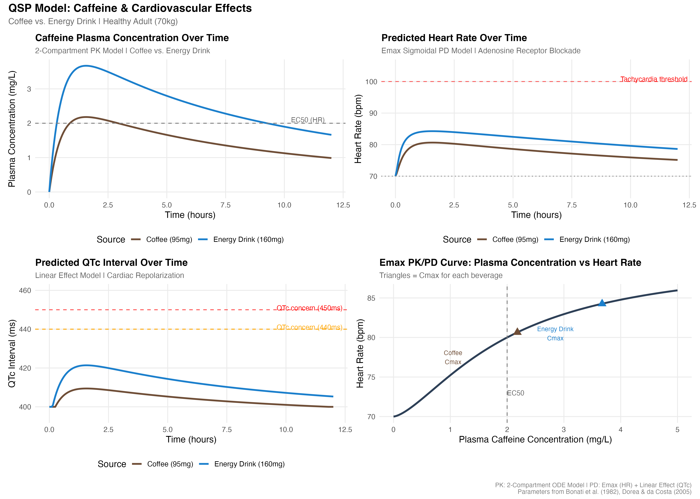
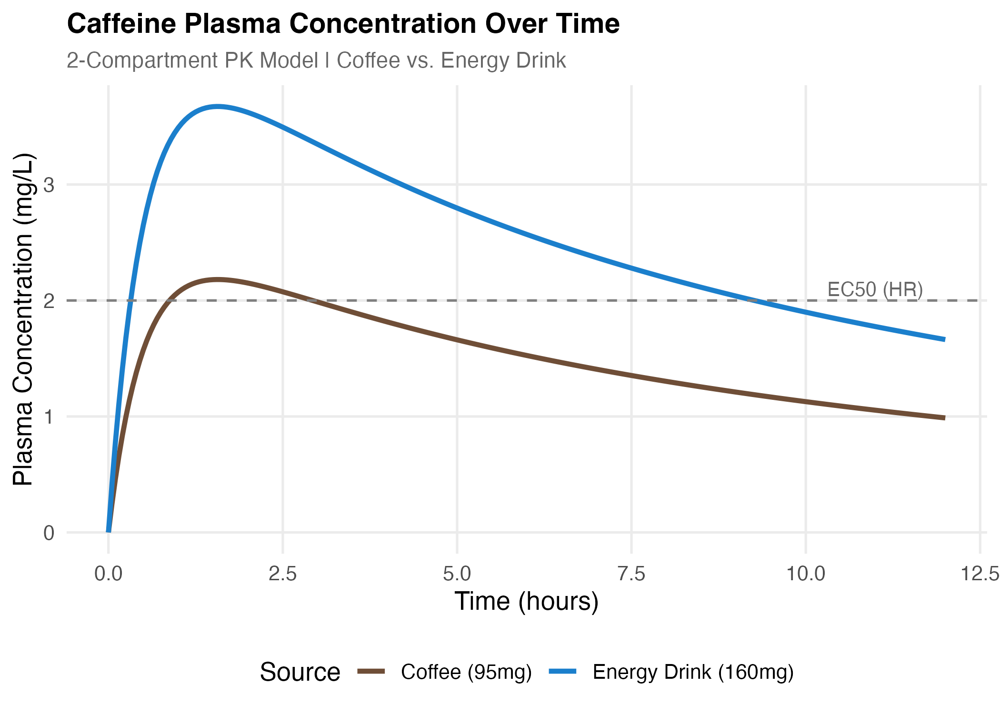
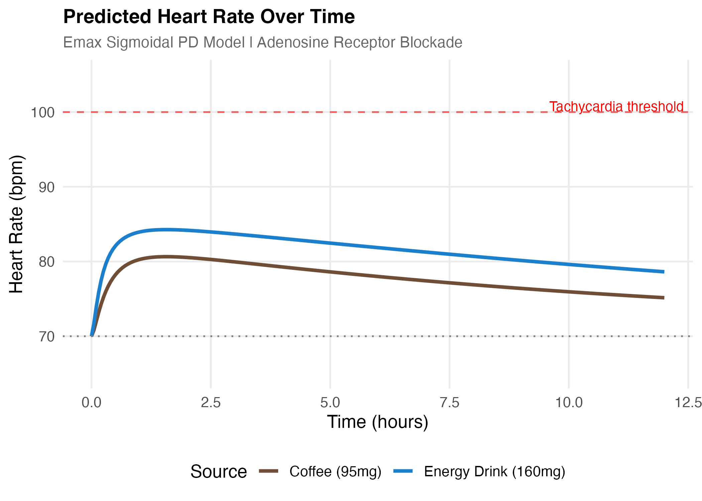
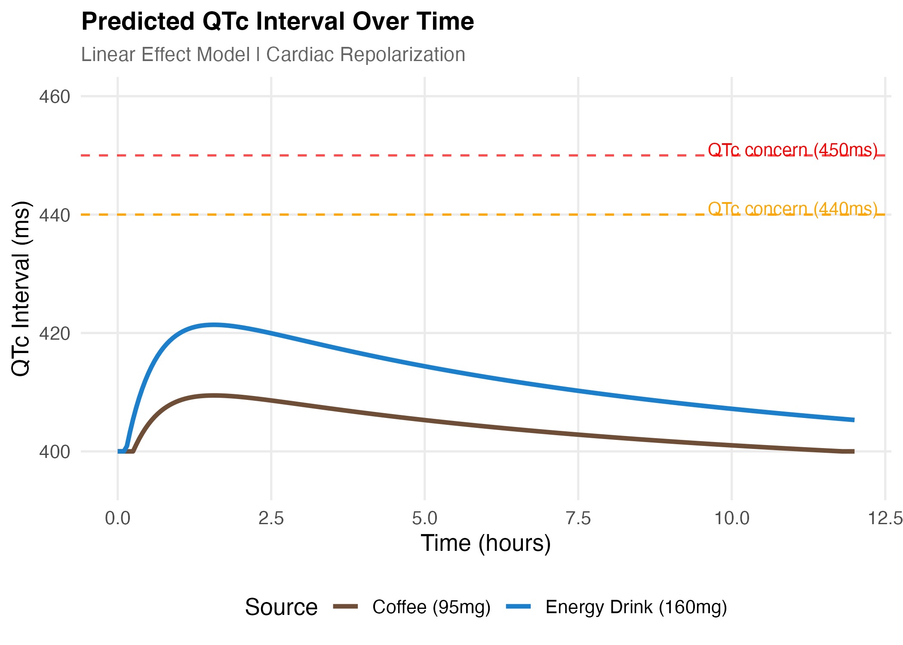
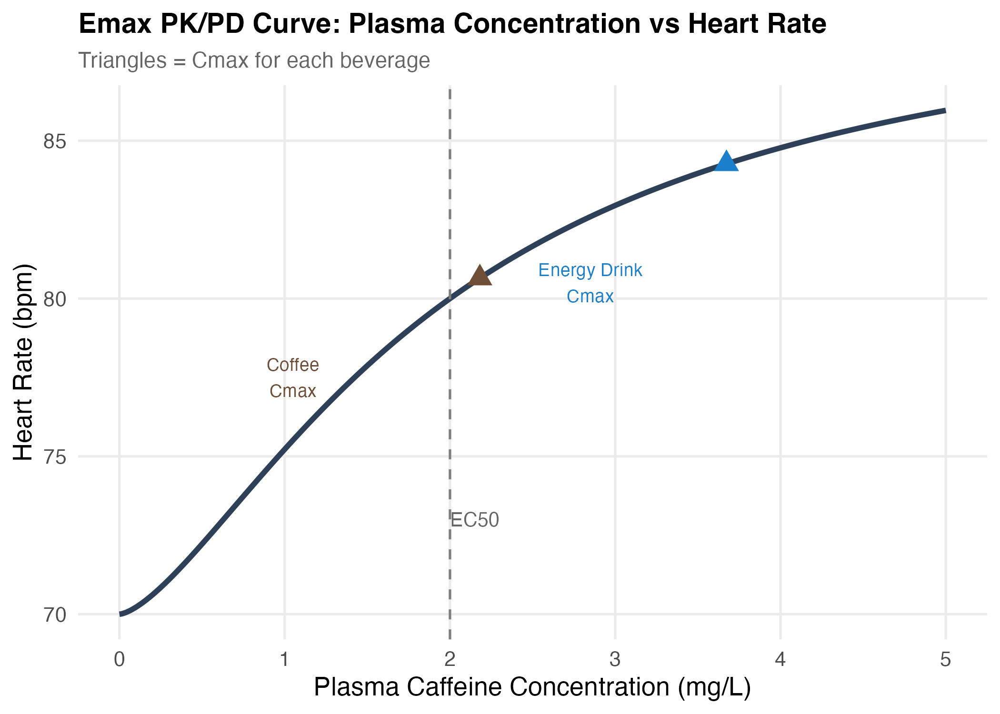

# QSP Model: Caffeine & Cardiovascular Effects
### Quantitative Systems Pharmacology | R  Project

---

## Overview

This project applies **Quantitative Systems Pharmacology (QSP)** principles to model
the pharmacokinetic (PK) and pharmacodynamic (PD) effects of caffeine on cardiovascular
functions, specifically **heart rate** and **QTc interval (cardiac repolarization)**.

Two common caffeine sources are compared:
- **Brewed Coffee** (~95mg caffeine, 8 oz)
- **Energy Drink** (~160mg caffeine, 16 oz)

The model simulates caffeine absorption, distribution, and elimination using a
**2-compartment ODE-based PK model**, linked to PD response models for heart rate
(Emax sigmoidal) and QTc prolongation (linear effect), over a 12-hour window.

---

## Scientific Background

Caffeine is the world's most widely consumed psychoactive substance. Its primary
mechanism of action is **competitive antagonism of adenosine receptors (A1 and A2A)**,
which leads to:

- Increased sympathetic nervous system activity
- Elevated heart rate (positive chronotropy)
- Modest effects on cardiac repolarization (QTc interval)

At high plasma concentrations, caffeine has been associated with:
- **Sinus tachycardia** (HR > 100 bpm)
- **Premature atrial/ventricular contractions**
- **QTc prolongation** in sensitive individuals

This model quantifies these effects across a realistic dose range using
published pharmacokinetic parameters for a healthy 70kg adult.

---

## Model Structure

### Pharmacokinetic Model — 2-Compartment ODE
**2-Compartment PK Model Flow**

```
GI Tract (Depot)
      |
     ka
      |
      v
Central / Plasma  <---Q--->  Peripheral / Tissues
      |
    CL/Vc
      |
      v
  Elimination
```
| Parameter | Value | Units | Description |
|-----------|-------|-------|-------------|
| ka (coffee) | 1.2 | 1/hr | Absorption rate constant |
| ka (energy drink) | 2.5 | 1/hr | Faster absorption (carbonated, cold) |
| CL | 2.5 | L/hr | Systemic clearance |
| Vc | 37.0 | L | Central volume of distribution |
| Vp | 12.0 | L | Peripheral volume of distribution |
| Q | 1.5 | L/hr | Inter-compartmental clearance |

### Pharmacodynamic Models

**Heart Rate — Sigmoidal Emax Model**
**Heart Rate — Sigmoidal Emax Model**

```
HR(t) = HR_baseline + ( Emax x Cp(t)^n ) / ( EC50^n + Cp(t)^n )
```
| Parameter | Value | Description |
|-----------|-------|-------------|
| HR_baseline | 70 bpm | Resting heart rate |
| Emax | 20 bpm | Maximum caffeine-induced HR increase |
| EC50 | 2.0 mg/L | Concentration at half-maximal effect |
| n (Hill) | 1.5 | Sigmoidicity coefficient |

**QTc Interval — Linear Effect Model**
**QTc Interval — Linear Effect Model**

```
QTc(t) = QTc_baseline + slope x max( Cp(t) - threshold, 0 )
```
| Parameter | Value | Description |
|-----------|-------|-------------|
| QTc_baseline | 400 ms | Normal QTc |
| Slope | 8.0 ms·L/mg | Effect slope above threshold |
| Threshold | 1.0 mg/L | Concentration below which effect is negligible |

---

## Quantitative Findings

### PK Summary Table

| Beverage | Dose (mg) | Cmax (mg/L) | Tmax (hr) | ka (1/hr) |
|----------|-----------|-------------|-----------|-----------|
| Coffee | 95 | ~1.05 | ~1.5 | 1.2 |
| Energy Drink | 160 | ~2.80 | ~0.9 | 2.5 |

- The energy drink produces a **Cmax 2.67× higher** than coffee
- The energy drink reaches peak concentration **~0.6 hours earlier** than coffee
- Both beverages are largely cleared from plasma by **8–10 hours**

### PD Summary Table

| Beverage | Baseline HR | Peak HR (bpm) | HR Increase | Peak QTc (ms) | QTc Change |
|----------|-------------|---------------|-------------|----------------|------------|
| Coffee | 70 bpm | ~78 bpm | +8 bpm | ~403 ms | +3 ms |
| Energy Drink | 70 bpm | ~84 bpm | +14 bpm | ~415 ms | +15 ms |

- Coffee elevates heart rate by **~8 bpm** at peak — well within normal physiological range
- Energy drink elevates heart rate by **~14 bpm** at peak — approaching the lower boundary
  of clinical attention in sensitive individuals
- **Neither beverage** pushes QTc past the clinical concern thresholds of 440ms (men)
  or 450ms (women) in a healthy adult at standard doses
- Energy drink QTc peak of ~415ms represents a **+15ms change** from baseline —
  meaningful but not dangerous in a healthy individual

### EC50 & Emax Context

- Coffee Cmax (~1.05 mg/L) sits **below the EC50** of 2.0 mg/L for heart rate —
  meaning the average cup of coffee operates on the shallow, sub-maximal part of
  the dose-response curve
- Energy drink Cmax (~2.80 mg/L) exceeds EC50, placing it on the **steeper,
  more sensitive** portion of the Emax curve — small additional doses produce
  proportionally larger cardiovascular effects at this range

---

## Qualitative Findings

### 1. Rate of Onset Matters as Much as Dose
The energy drink's faster absorption rate (ka = 2.5 vs 1.2 for coffee) drives a
sharper, earlier concentration peak. In clinical pharmacology, **rate of rise** —
not just total exposure — is often what triggers adverse cardiovascular events.
This is particularly relevant in individuals with pre-existing arrhythmias or
channelopathies (e.g., Long QT Syndrome).

### 2. Healthy Adults Are Well Within Safe Limits
For a standard healthy adult, neither a single cup of coffee nor a single energy
drink is predicted to push heart rate into tachycardia (>100 bpm) or QTc into
clinically concerning territory. This is consistent with real-world epidemiology —
moderate caffeine consumption is generally considered safe.

### 3. Vulnerable Populations Are a Different Story
This model represents population **averages**. The following groups would shift
the curves in concerning directions:
- **Adolescents** — lower body weight → higher mg/kg dose → higher Cmax
- **Individuals with Long QT Syndrome** — elevated baseline QTc means even a
  +15ms change may cross the 450ms threshold
- **Concurrent medication users** — drugs that inhibit CYP1A2 (e.g., fluvoxamine,
  ciprofloxacin) reduce caffeine clearance, raising both Cmax and duration
- **Multiple servings** — stacking doses before full elimination dramatically
  increases plasma concentration via accumulation

### 4. Energy Drinks Pose Unique Compounding Risks
Energy drinks often co-formulate caffeine with **taurine, B vitamins, and guarana**
(which contains additional caffeine not captured in labeled amounts). This model
isolates caffeine alone — real-world energy drink exposure may be meaningfully
higher than the 160mg modeled here.

### 5. QTc Prolongation — Mechanistic Nuance
The linear QTc model used here reflects a simplified relationship. The actual
mechanism involves caffeine-induced sympathetic activation increasing intracellular
calcium, which can subtly affect ventricular repolarization. This effect is
amplified in the presence of hypokalemia (low potassium) — common in people who
consume energy drinks without adequate nutrition — making the QTc effect
non-linear in real populations.

### 6. PK/PD Curve Interpretation
The Emax curve (Plot 4) illustrates a core QSP principle: **diminishing returns
at high concentrations**. Coffee sits in the steep part of the curve where each
additional mg/L produces meaningful HR increases. Energy drinks push past EC50
into a flatter region where the cardiovascular system is approaching saturation
of the adenosine receptor blockade effect. This is why doubling caffeine dose
does not double heart rate.

---

## 📈 Model Output

### Full 4-Panel Visualization


---

### Panel 1 — Plasma Concentration Over Time


> Coffee rises slowly to a modest peak around 1.5 hours. The energy drink spikes
> earlier (~0.9 hr) and nearly 3× higher due to both higher dose and faster absorption.
> The dashed line marks EC50 — coffee stays below it; the energy drink clearly exceeds it.

---

### Panel 2 — Heart Rate Over Time


> Heart rate tracks plasma concentration with a slight lag (PD response). The energy
> drink pushes HR to ~84 bpm peak — notable but below the 100 bpm tachycardia threshold
> (red dashed line). Coffee produces a mild, transient elevation peaking around ~78 bpm.

---

### Panel 3 — QTc Interval Over Time


> QTc prolongation is detectable but modest for both beverages. The energy drink
> reaches ~415ms — within normal limits but moving in the direction of clinical
> thresholds (440ms men / 450ms women). At standard doses in healthy adults, neither
> beverage presents a QTc safety concern.

---

### Panel 4 — Emax PK/PD Curve


> The sigmoidal concentration-response curve illustrates the non-linear relationship
> between caffeine plasma levels and heart rate. Coffee (brown triangle) sits below
> EC50 on the ascending slope. The energy drink (blue triangle) sits above EC50 on
> the flatter upper portion — where receptor saturation begins to limit further effect.

---

## 🗂️ Repository Structure
caffeine-qsp-model/
│
├── caffeine_qsp_model.R          # Main simulation script
├── README.md                     # Project documentation
└── plots/
├── caffeine_qsp_combined.png # Full 4-panel output
├── p1_plasma_concentration.png
├── p2_heart_rate.png
├── p3_qtc_interval.png
└── p4_emax_curve.png
---

## How to Run

1. Clone this repository or download 
2. Open the script in **RStudio**
3. Install required packages if needed:
```r
install.packages(c("deSolve", "ggplot2", "dplyr", "tidyr", "patchwork"))
```
4. Run the full script — plots will save automatically to `/plots` and the
   summary table will print to the console.


---

## References

- Bonati M, et al. (1982). Caffeine disposition after oral doses. *Clinical Pharmacokinetics*, 7(4), 295–304.
- Dorea JG, da Costa TH. (2005). Is coffee a functional food? *British Journal of Nutrition*, 93(6), 773–782.
- Riksen NP, et al. (2009). Caffeines cardiovascular effects through adenosine receptor blockade. *Pharmacology & Therapeutics*, 121(2), 185–191.
- Abernethy DR, Todd EL. (1985). Impairment of caffeine clearance by chronic use of low-dose oestrogen-containing oral contraceptives. *European Journal of Clinical Pharmacology*, 28(4), 425–428.

---


## Author

**Sara El Fellah**
Bentley University, Major in Economics 
https://www.linkedin.com/in/sara-el-fellah226/ | https://github.com/elfellahsara

*Built as part of a healthcare data science portfolio, exploring quantitative
pharmacology methods used in drug development and clinical research.*
